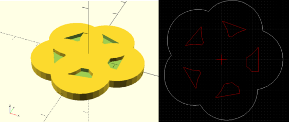

# Projekt

Projekt is a tool based on Cura that allow you to slice STL parts into DXF for
laser machines, with cutting and engraving.

## Getting it

First, install wks:

    pip install wks

Then, run:

    mkdir projekt_wks
    cd projekt_wks
    wks install rhoban/projekt

And:

    wks build

The binary will be output in `build/bin/projekt`.

## Usage

Basically:

    projekt input.stl > out.dxf

Will produce a dxf with (red) cutting lines for your laser cutting machines.

You can also specify the output using `-o`:

    projekt -o out.dxf input.stl

Note that some software use XZ plane as ground, you can use it with `-z`:
    
    projekt -z -o out.dxf input.stl

You can then add engraving layers using the `-e` option, for instance:

    projekt -e 2.5:1 -o out.dxf input.stl

Will generate red lines for cutting and red polygons to engrave the difference
between the first layer and the layer at 2.5mm from the bottom of your STL.

You can specify multiple engraving, like this:

    projekt -e 2.5:1 -e 2.9:2 -o out.dxf input.stl
	
You can also output (simplified) SVG format:

    projekt -e 2.5:red -f svg input.stl > out.svg

Do not hesitate to open an issue for any question!
